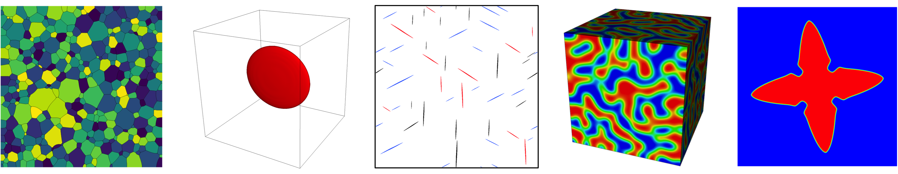

***
## Overview
PRISMS-MultiPhysics (PRISMS-MP) open-source, coupled phase field-crystal plasticity framework.

<!--  -->

***
## Announcements

- 9/19/2025: We are release of Webpage and [Users Manual](https://prisms-center.github.io/multiPhysics/doxygen/index.html): Both of these are still under construction.

([older announcements](pages/announcements.md))

***

### Features and Capabilities

- Matrix-free finite element framework for improved performance over traditional finite element approaches
- Parallelization at the inter-node, intra-node, and intra-core levels (MPI, threads, vectorization), with near ideal scaling beyond 1,000 cores

### Acknowledgements
This code is developed by the PRedictive Integrated Structural Materials Science (PRISMS) Center at University of Michigan which is supported by the U.S. Department of Energy (DOE), Office of Basic Energy Sciences, Division of Materials Sciences and Engineering under Award #DE-SC0008637.

### License
PRISMS-MP is released under the GNU Lesser General Public License (LGPL).

### Citing PRISMS-MP

***

## General Links
- [PRISMS Center homepage](http://www.prisms-center.org/#/home)  
- [PRISMS-MP code repository](https://github.com/prisms-center/multiPhysics)  
- [YouTube channel](https://www.youtube.com/channel/UCZXc3007JuBCGKDcneD_umA/playlists)
- [Virtual Machine](http://www.prisms-center.org/#/ctools/software) (contains most of the PRISMS Center tools, including PRISMS-MP)

***
## Getting Started
- [Quick start guide](https://github.com/prisms-center/multiPhysics/#quick-start-guide)  
- [Installation instructions](doxygen/install.html)  
- [User manual](doxygen/index.html)  
- [Repository of training slides and exercises](https://goo.gl/BBTkJ8)
- [Tutorials](https://github.com/prisms-center/multiPhysics/blob/gh-pages/pages/tutorial.md)

***
## Getting Help
- [PRISMS-MP forum](https://groups.google.com/forum/#!forum/prisms-mp-users)  
- [Code documentation](doxygen/index.html)  
<!-- - [Email the developers](mailto:prismsmultiPhysics.dev@umich.edu) -->

***
<!--
## Publications That Use PRISMS-MP

\*[DeWitt, Rudraraju, Montiel, Andrews and Thornton, PRISMS-PF: A general framework for phase-field modeling with a matrix-free finite element method, npj Comput Mater 6, 29 (2020)](https://www.nature.com/articles/s41524-020-0298-5)

\* Please use this publication as the standard reference when citing PRISMS-MP.

Note: If you use PRISMS-MP in one of your publications, please send the publication information to [prismsmultiphysics.dev@umich.edu](mailto:prismsmultiphysics.dev@umich.edu) to help us demonstrate our impact to our funding agency.

***
## Publications That Cite PRISMS-MP

-->